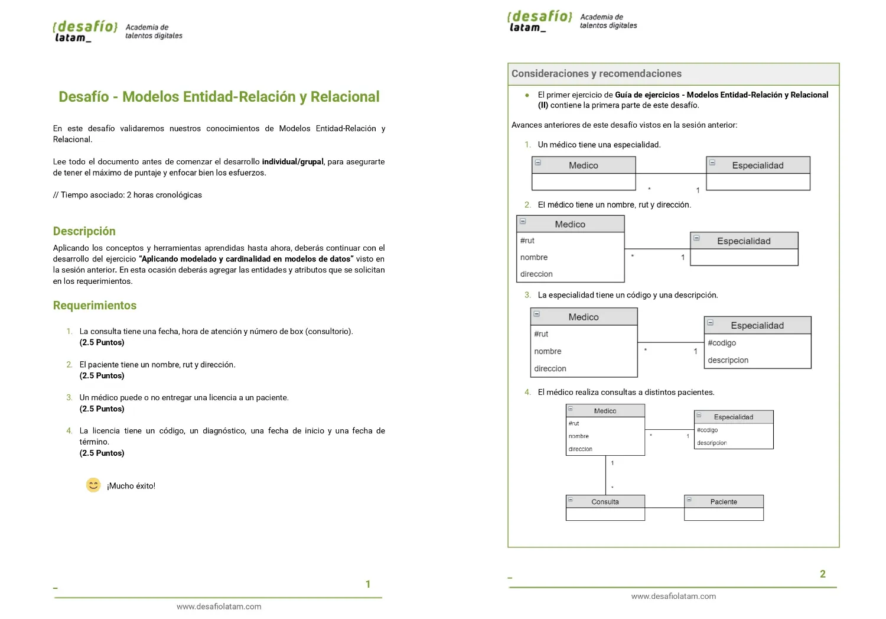

# Desafío 4: Modelos Entidad-Relación y Relacional

El presente repositorio contiene el código del desafío número 4 y último del módulo 5 llamado **Fundamentos de bases de datos relacionales** de la beca Desarrollo de aplicaciones Full Stack Javascript Trainee dictada por Desafío Latam. Los requisitos del proyecto son los siguientes:

El diagrama que he construido consta de **5 tablas** siendo 4 tablas de dimensiones y 1 tabla de hechos. Las tablas de dimensiones son: **Especialidad**, **Médico**, **Paciente** y **Licencia**. La tabla de hechos es: **Consulta**.

La imagen del diagrama es la siguiente:

A continuación explico mi solución a cada requerimiento:

## 1. La consulta tiene una fecha, hora de atención y número de box (consultorio)

La tabla de hechos **Consulta** tiene los 3 atributos solicitados junto con una clave primaria del tipo autoincremental junto con tres claves foráneas con referencia a las claves primarias de las tablas de dimensiones **Médico**, **Paciente** y **Licencia**.

## 2. El paciente tiene un nombre, rut y dirección

La tabla de dimensiones **Paciente** contiene los 3 atributos solicitados junto con un atributo adicional el cual es la clave primaria de tipo autoincremental.

## 3. Un médico puede o no entregar una licencia a un paciente

La acción de entregar una licencia la incluyo en la tabla de hechos **Consulta** en base al atributo **Licencia_ID(Licencia)** la cual es clave foránea que referencia a la clave primaria de la tabla de dimensión **Licencia**. La cardinalidad es la siguiente:

-Desde la tabla **Licencia** hacia la tabla **Consulta**: una licencia solo puede estar asociada a una consulta por lo que la relación es de 1:1.

-Desde la tabla **Consulta** hacia la tabla **Licencia**: una consulta puede tener asociada la emisión de licencia o no por lo que la relación es de 0..1:1

## 4. La licencia tiene un código, un diagnóstico, una fecha de inicio y una fecha de término

La tabla **Licencia** posee los 4 atributos requeridos además de un atributo adicional **Licencia_ID** la cual es la clave primaria de tipo autoincremental.

A continuación, muestro el diagrama lógico de cardinalidad con más detalle:

El diagrama anterior permite responder preguntas como:

1- Dado un código de licencia, ¿Qué especialidad tiene el médico que emitio la licencia?. Dicha pregunta se puede responder realizando un join de las tablas **Licencia**, **Consulta**, **Médico** y **Especialidad**.

2-Mostrar todas las consultas que no han emitido licencias. Esto se puede averiguar al filtrar el atributo **Licencia_ID (Licencia)** de la tabla **Consulta** por valores nulos.

3- Averiguar que médico ha emitido la mayor cantidad de licencias con una duración de más de 6 meses. Dicha pregunta se puede responder realizando un join de las tablas **Médico**, **Consulta** y **Licencia**.
